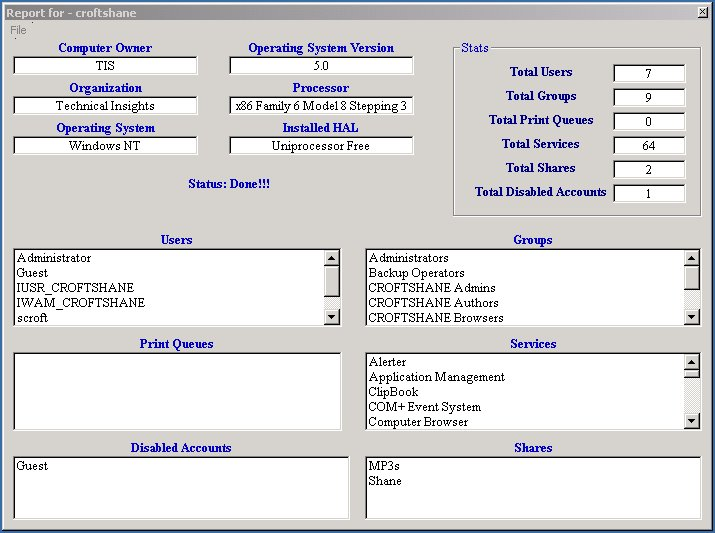



## Server Report

### Description

You must make sure you have ADSI 2.5 installed. This is free from microsoft. This program is for Windows NT and 2000 all versions. This will get some information on the server like users, groups, print queues, services, disabled accounts, and file shares. This code can be easily modified to get so much informtation that it could be one of the best out there. But right now it is basic. It also has a PRINT option to print out the report. Please vote.
 
### More Info
 

             |
---                |---
**Submitted On**   |2000-12-01 09:02:54
**By**             |[Shane Croft](https://github.com/Planet-Source-Code/PSCIndex/blob/master/ByAuthor/shane-croft.md)
**Level**          |Intermediate
**User Rating**    |4.4 (35 globes from 8 users)
**Compatibility**  |VB 6\.0
**Category**       |[Complete Applications](https://github.com/Planet-Source-Code/PSCIndex/blob/master/ByCategory/complete-applications__1-27.md)
**World**          |[Visual Basic](https://github.com/Planet-Source-Code/PSCIndex/blob/master/ByWorld/visual-basic.md)
**Archive File**   |[CODE\_UPLOAD122301212000\.zip](https://github.com/Planet-Source-Code/shane-croft-server-report__1-13241/archive/master.zip)

